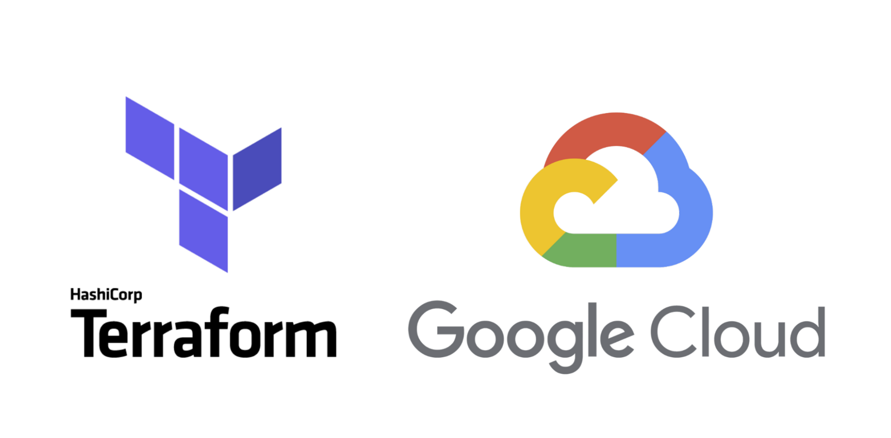

# My Journey: Learning Kubernetes the Hard Way (with a Terraform Twist)

## Hey there! 👋

So, I decided to tackle one of the most notorious learning challenges in the Kubernetes world - Kelsey Hightower's "Kubernetes the Hard Way." But here's the thing: I'm a big fan of Infrastructure as Code, so I thought, "Why not make this a bit more... modern?"


This is my attempt at combining the educational goldmine that is K8s the Hard Way with Terraform automation. Spoiler alert: I learned WAY more than I expected!

## What I'm Actually Building

Instead of manually clicking around the GCP console (which, let's be honest, gets old fast), I'm using Terraform to spin up the infrastructure, then diving deep into the manual Kubernetes setup. Best of both worlds!


### My Lab Setup
I'm running this whole thing on Google Cloud with:

- A jumpbox (because I like having a clean workspace)

- One control plane node (where all the Kubernetes brain stuff happens)

- Two worker nodes (where the actual work gets done)

Nothing fancy - just `e2-small` instances because I'm not made of money! 💸

## Why I'm Doing This

Honestly? I kept hearing people talk about "understanding Kubernetes internals" and felt like I was missing something. Sure, I can `kubectl apply` with the best of them, but what's actually happening under the hood?

Plus, I wanted to get better at:

- Terraform

- Understanding how all these Kubernetes pieces fit together

- Documenting my learning 

- Maybe helping someone else who's on the same journey :)

## The Learning Curve is Real

Not gonna lie - this isn't a weekend project. The original tutorial takes several hours, and that's assuming you don't hit any weird issues (spoiler: you will). But that's kind of the point, right?

Every time something breaks (and trust me, things will break), you learn something new about how Kubernetes actually works.

## What's Different About My Approach

### The Good Stuff
- **Terraform automation** means I can rebuild everything from scratch if I mess up (which I did... multiple times)
- **Actual documentation** that I can refer back to later
- **Real infrastructure** that I can poke and prod without breaking someone else's stuff

### The Reality Check
- Still have to do all the certificate generation manually
- Still need to configure each Kubernetes component by hand
- Still plenty of opportunities to make typos and wonder why nothing works

## My Setup Journey

Here's roughly what I'm walking through:

1. **Getting GCP ready** - Service accounts, APIs, all that fun setup stuff
2. **Terraform magic** - Let the machines do what machines do best
3. **The hard way begins** - Manual K8s component installation and configuration
4. **Victory dance** - When `kubectl get nodes` finally shows "Ready" status
5. **Documentation** - Writing it all down so future me doesn't have to figure it out again

## Want to Follow Along?

I'm documenting everything as I go - the wins, the failures, and all the "why didn't that work?" moments in between. If you're curious about Kubernetes internals or just want to see someone figure this stuff out in real-time, stick around!

The whole project is on GitHub, and I'm trying to make the documentation actually useful (not just "draw the rest of the owl" style).

## Quick Start (If You're Feeling Brave)

Ready to jump in? Here's your roadmap:

1. **[Get Your Environment Ready](setup/prerequisites.md)** - The boring but necessary stuff
2. **[Configure GCP](setup/gcp-setup.md)** - Make Google Cloud play nice
3. **[Deploy Infrastructure](infrastructure/terraform-deployment.md)** - Let Terraform do its thing
4. **[Build Kubernetes](kubernetes/manual-setup.md)** - The main event!
5. **[Make Sure It Works](kubernetes/cluster-validation.md)** - Cross your fingers and test

Fair warning: Budget a few hours and have coffee ready. ☕

## Repository Tour

```
k8s-the-hardway/
├── terraform/          # Infrastructure as Code configuration
│   ├── main.tf        # Root Terraform module
│   ├── variables.tf   # Input variable definitions
│   ├── outputs.tf     # Output value definitions
│   ├── providers.tf   # Provider configurations
│   ├── terraform.tfvars.example  # Example variable values
│   ├── machines.txt   # Server inventory and connection details
│   ├── credentials/   # GCP service account keys and hostnames
│   ├── modules/       # Reusable GCE and network modules
│   │   ├── gce-instance/  # Compute instance module
│   │   └── gce-network/   # VPC and firewall module
│   └── README.md      # Detailed Terraform setup guide
├── k8s-thw-docs/      # MkDocs blog/documentation site
│   ├── docs/          # Markdown content
│   ├── mkdocs.yml     # Site configuration
│   └── README.md      # Documentation setup guide
└── README.md          # This overview file
```

## Why Document This?

Because I know I'll forget how I did this in six months, and maybe it'll help someone else avoid the same pitfalls I'm stumbling into.

Plus, there's something satisfying about turning a messy learning process into clean documentation that actually makes sense.

---

**Ready to dive into the deep end of Kubernetes?** Let's start with [setting up our prerequisites](setup/prerequisites.md) and see where this journey takes us!

*P.S. - If you spot any mistakes or have suggestions, I'm all ears! This is my first time documenting a project like this, so feedback is more than welcome.*