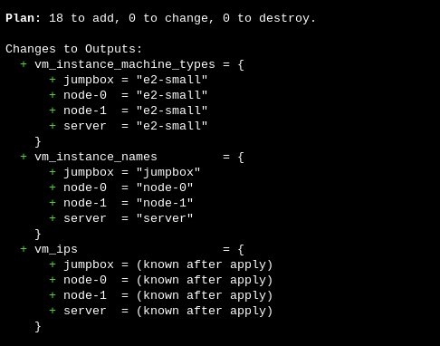
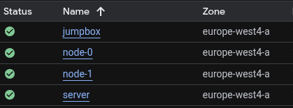

# Terraform Deployment: Bringing Infrastructure to Life

Time to turn our Terraform configuration into actual cloud infrastructure! This is where the magic happens - we go from code to running VMs in just a few minutes.

## Pre-Deployment Checklist

Before we start, let's make sure everything is ready:

- ✅ GCP project created and configured
- ✅ Service account key downloaded
- ✅ SSH keys generated
- ✅ Terraform installed and working

## Configuration Setup

### 1. Clone or Navigate to the Project
```bash
# If you haven't already, get the project
cd ~/k8s-the-hardway/terraform
```

### 2. Configure Backend and Variables

First, update the backend configuration in `providers.tf` with your GCS bucket name:

```hcl
terraform {
    required_providers {
        google = {
            source  = "hashicorp/google"
            version = "6.47.0"
        }
    }
    backend "gcs" {
        bucket  = "your-bucket-name-here"  # Replace with your actual bucket name
        prefix  = "terraform/state"
    }
}
```

Then configure your variables:
```bash
# Copy the example configuration
cp terraform.tfvars.example terraform.tfvars

# Edit with your specific values
vim terraform.tfvars
```

Here's what your `terraform.tfvars` should look like:

```hcl
# Your GCP project details
project_id   = "k8s-thw-yourname-20240816"  # Your actual project ID
vpc_name     = "k8s-thw-vpc"
ssh_key      = "~/.ssh/id_ed25519.pub"         # Path to your public key
ssh_username = "yourname"                    # Your username
sa_account   = "k8s-tf"                     # Service account name
boot_disk    = "pd-balanced"
gce_tags     = ["k8s-thw"]

# VM Configuration - these create our 4 machines
vms = {
  jumpbox = {
    name         = "jumpbox"
    machine_type = "e2-small"
    disk_size_gb = 10
  }
  server = {
    name         = "server"
    machine_type = "e2-small"
    disk_size_gb = 20
  }
  node-0 = {
    name         = "node-0"
    machine_type = "e2-small"
    disk_size_gb = 20
  }
  node-1 = {
    name         = "node-1"
    machine_type = "e2-small"
    disk_size_gb = 20
  }
}

# Network Security
google_credentials     = "credentials/k8s-tf.json"
firewall_ports        = ["22", "80", "443", "6443", "2379-2380", "10250", "30000-32767"]
firewall_protocols    = "tcp"
firewall_target_tags  = ["k8s-thw"]
firewall_source_ranges = ["0.0.0.0/0"]  # ⚠️ Open to world - lab only!
```

!!! warning "Security Note"
    The `firewall_source_ranges = ["0.0.0.0/0"]` setting allows access from anywhere on the internet. For production, you'd want to restrict this to your IP address.

## Deployment Process

### 1. Initialize Terraform
```bash
# Download providers and initialize working directory with GCS backend
terraform init
```

You should see output like:
```
Initializing the backend...

Successfully configured the backend "gcs"! Terraform will automatically
use this backend unless the backend configuration changes.

Initializing provider plugins...
- Finding hashicorp/google versions matching "6.47.0"...
- Installing hashicorp/google v6.47.0...

Terraform has been successfully initialized!
```

!!! tip "Backend Initialization"
    The first time you run `terraform init`, it will configure the GCS backend and create the state file in your bucket. Subsequent runs will use the existing state.

### 2. Plan the Deployment
```bash
# See what Terraform will create
terraform plan
```

This shows you exactly what resources will be created. Look for:

- 4 compute instances (jumpbox, server, node-0, node-1)
- 4 static IP addresses
- 1 VPC network
- Multiple firewall rules



### 3. Deploy the Infrastructure
```bash
# Create the infrastructure
terraform apply
```

Terraform will show you the plan again and ask for confirmation. Type `yes` to proceed.

!!! tip "Deployment Time"
    The deployment usually takes 2-3 minutes. Perfect time for a coffee break! ☕

## What's Happening During Deployment

### Phase 1: Network Setup
```
google_compute_network.k8s_network: Creating...
google_compute_network.k8s_network: Creation complete after 45s
```

### Phase 2: Firewall Rules
```
google_compute_firewall.k8s_firewall: Creating...
google_compute_firewall.k8s_firewall: Creation complete after 12s
```

### Phase 3: Static IPs
```
google_compute_address.vm_static_ip["jumpbox"]: Creating...
google_compute_address.vm_static_ip["server"]: Creating...
# ... and so on
```

### Phase 4: VM Instances
```
google_compute_instance.vm_instance["jumpbox"]: Creating...
google_compute_instance.vm_instance["server"]: Creating...
# ... this is the longest part
```

## Post-Deployment Verification

### 1. Check Terraform Outputs
```bash
# See all the important information
terraform output

# Get just the IP addresses
terraform output vm_ips
```

You should see something like:
```
vm_ips = {
  "jumpbox" = "34.90.50.182"
  "server" = "34.13.164.225"
  "node-0" = "34.32.227.137"
  "node-1" = "35.195.123.45"
}
```

### 2. Verify in GCP Console
Check the [GCP Console](https://console.cloud.google.com/compute/instances) to see your shiny new VMs!



### 3. Test SSH Connectivity
```bash
# Test connection to jumpbox (replace with your actual IP)
ssh root@JUMPBOX_IP
```

## Create the machines.txt File

The Kubernetes The Hard Way tutorial expects a `machines.txt` file. Let's create it:

```bash
# Create machines.txt with your actual IPs and project-specific hostnames
# Note: GCP uses internal FQDN format: {instance}.{zone}.c.{project-id}.internal
# This example uses project ID 'k8s-thehardway-465822' - replace with your project ID

# Get your project ID
PROJECT_ID=$(gcloud config get-value project)
ZONE="europe-west4-a"  # or your chosen zone

# Create machines.txt with dynamic hostnames
terraform output -json vm_ips | jq -r --arg project_id "$PROJECT_ID" --arg zone "$ZONE" '
  .server + " server." + $zone + ".c." + $project_id + ".internal server", 
  ."node-0" + " node-0." + $zone + ".c." + $project_id + ".internal node-0 10.200.0.0/24",
  ."node-1" + " node-1." + $zone + ".c." + $project_id + ".internal node-1 10.200.1.0/24"
' > machines.txt

# Verify the file looks correct
cat machines.txt
```

## SSH Key Distribution

Now we need to copy our SSH key to the jumpbox so we can access other machines:

```bash
# Copy your private key to the jumpbox
scp ~/.ssh/id_ed25519 root@JUMPBOX_IP:/root/.ssh/
scp ~/.ssh/id_ed25519.pub root@JUMPBOX_IP:/root/.ssh/

# Copy machines.txt to jumpbox
scp machines.txt root@JUMPBOX_IP:~/

# SSH to jumpbox and set permissions
ssh root@JUMPBOX_IP

# On the jumpbox, set correct permissions
chmod 600 /root/.ssh/id_ed25519
chmod 644 /root/.ssh/id_ed25519.pub
```

## Final Connectivity Test

From the jumpbox, test access to all cluster nodes:

```bash
# Test SSH to all machines (run this on the jumpbox)
while read IP FQDN HOST remainder; do
  echo "Testing connection to $HOST ($IP)..."
  ssh -o StrictHostKeyChecking=no root@${IP} hostname < /dev/null
done < machines.txt
```

If everything works, you should see each machine respond with its hostname!

## Troubleshooting Common Issues

### "Permission denied (publickey)" Error
- Check that your SSH key is correctly specified in `terraform.tfvars`
- Verify the key file exists and has correct permissions
- Make sure you're using the right username

### "Connection refused" Error
- Wait a few minutes - instances might still be booting
- Check firewall rules in the GCP console
- Verify the instance is running

### Terraform State Issues
```bash
# If you get state lock errors
terraform force-unlock LOCK_ID

# If you need to refresh state
terraform refresh
```

## What's Next?

Congratulations! You now have a fully functional infrastructure ready for Kubernetes installation. 

Next up: [Infrastructure validation](validation.md) to make sure everything is working perfectly before we start the Kubernetes setup.

---

!!! success "Infrastructure Complete!"
    You've successfully deployed 4 VMs, networking, and security rules - all with just a few Terraform commands. That's the power of Infrastructure as Code!
