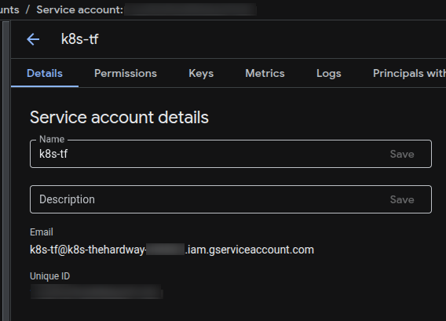
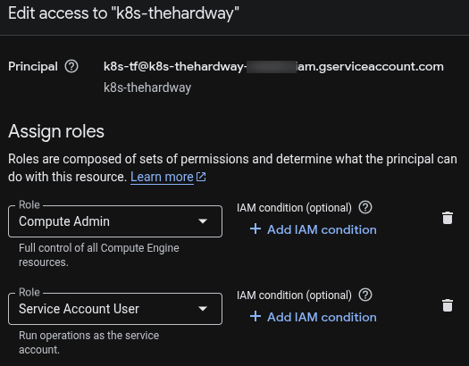
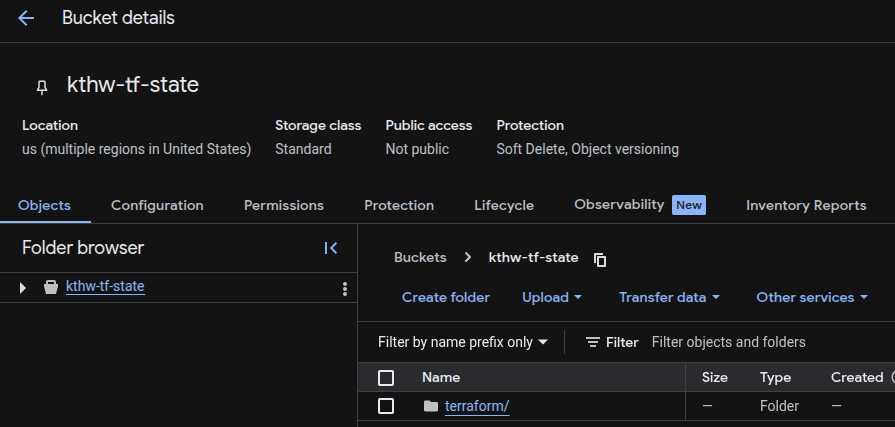

# GCP Setup: Preparing Your Cloud Environment

Time to get Google Cloud Platform ready for our Kubernetes adventure! This is where we set up the project, enable APIs, and create the service account that Terraform will use.

## Project Setup Options

You have two options for the GCP project setup:

=== "Create New Project"
    **Recommended for beginners or if you want a clean slate**
    
    ```bash
    # Set your project ID (make it unique!)
    export PROJECT_ID="k8s-thw-$(whoami)-$(date +%Y%m%d)"
    
    # Create the project
    gcloud projects create $PROJECT_ID --name="Kubernetes The Hard Way"
    
    # Set it as your default project
    gcloud config set project $PROJECT_ID
    
    # Enable billing (you'll need to do this in the console)
    echo "Don't forget to enable billing for project: $PROJECT_ID"
    ```
    
    !!! tip "Why Create a New Project?"
        - Clean environment with no existing resources
        - Easy to delete everything when you're done
        - No risk of interfering with existing workloads
        - Clear cost tracking for this specific lab

=== "Use Existing Project"
    **Good if you already have a dedicated testing/learning project**
    
    ```bash
    # List your existing projects
    gcloud projects list
    
    # Set your existing project ID
    export PROJECT_ID="your-existing-project-id"
    
    # Set it as your default project
    gcloud config set project $PROJECT_ID
    
    # Verify you're using the right project
    gcloud config get-value project
    ```
    
    !!! warning "Important Considerations"
        - Make sure this project doesn't contain production resources
        - Check existing firewall rules that might conflict
        - Verify you have sufficient quotas available
        - Consider the cost impact of additional resources

## Verify Project Setup

Regardless of which option you chose, verify your project is ready:

```bash
# Check current project
gcloud config get-value project

# Verify billing is enabled (required for creating resources)
gcloud beta billing projects describe $PROJECT_ID

```

!!! warning "Billing Required"
    You'll need billing enabled for your project. If using an existing project, make sure billing is already set up. For new projects, enable billing in the [GCP Console](https://console.cloud.google.com/billing).

## Enable Required APIs

We need several APIs enabled for Terraform to work its magic:

```bash
# Enable the APIs we'll need
gcloud services enable compute.googleapis.com
gcloud services enable iam.googleapis.com
gcloud services enable cloudresourcemanager.googleapis.com

# Verify they're enabled
gcloud services list --enabled --filter="name:(compute.googleapis.com OR iam.googleapis.com)"
```

!!! note "Existing Project Users"
    If you're using an existing project, some of these APIs might already be enabled. That's perfectly fine - the commands above are idempotent.

## Create a Service Account

Terraform needs a service account to manage resources on our behalf:

```bash
# Create the service account
gcloud iam service-accounts create k8s-tf \
    --description="Terraform service account for Kubernetes The Hard Way" \
    --display-name="K8s Terraform SA"

# Grant necessary permissions
gcloud projects add-iam-policy-binding $PROJECT_ID \
    --member="serviceAccount:k8s-tf@$PROJECT_ID.iam.gserviceaccount.com" \
    --role="roles/compute.admin"

gcloud projects add-iam-policy-binding $PROJECT_ID \
    --member="serviceAccount:k8s-tf@$PROJECT_ID.iam.gserviceaccount.com" \
    --role="roles/iam.serviceAccountUser"

# Create and download the service account key
mkdir -p ~/k8s-the-hardway/terraform/credentials
gcloud iam service-accounts keys create ~/k8s-the-hardway/terraform/credentials/k8s-tf.json \
    --iam-account=k8s-tf@$PROJECT_ID.iam.gserviceaccount.com
```



!!! tip "Service Account Security"
    The service account key file contains sensitive credentials. Never commit it to version control!

## Check for Existing Resources (Existing Project Users)

If you're using an existing project, it's good to check what's already there:

```bash
# Check existing VPC networks
gcloud compute networks list

# Check existing firewall rules
gcloud compute firewall-rules list

# Check existing compute instances
gcloud compute instances list

# Check existing static IP addresses
gcloud compute addresses list
```

!!! warning "Resource Conflicts"
    If you see resources with similar names to what we'll create (like `k8s-thw-vpc`), you might want to modify the names in your Terraform configuration to avoid conflicts.

## Verify Your Setup

Let's make sure everything is working correctly:

```bash
# Check your current project
gcloud config get-value project

# Verify APIs are enabled
gcloud services list --enabled --filter="compute"

# Check service account exists
gcloud iam service-accounts list --filter="email:k8s-tf@*"

# Verify the key file was created
ls -la ~/k8s-the-hardway/terraform/credentials/k8s-tf.json

# Test service account permissions (optional)
gcloud auth activate-service-account --key-file=~/k8s-the-hardway/terraform/credentials/k8s-tf.json
gcloud compute zones list --limit=5
gcloud auth revoke  # Switch back to your user account
```

## Understanding the Permissions

Let's break down what we just gave our service account:

### `roles/compute.admin`
- Create and manage VM instances
- Create and manage networks and firewalls
- Manage static IP addresses
- Everything we need for our infrastructure

### `roles/iam.serviceAccountUser`
- Allows Terraform to act as service accounts
- Required for some GCE operations




!!! note "Principle of Least Privilege"
    In production, you'd want more granular permissions. For learning purposes, these broad roles make things simpler.


## Project Cleanup Considerations

### For New Projects
When you're done with the lab:
```bash
# Easy cleanup - delete the entire project
gcloud projects delete $PROJECT_ID
```

### For Existing Projects
When you're done with the lab:
```bash
# Use Terraform to clean up resources
cd ~/k8s-the-hardway/terraform
terraform destroy

# Manually clean up the service account
gcloud iam service-accounts delete k8s-tf@$PROJECT_ID.iam.gserviceaccount.com
```

## Create GCS Bucket for Terraform State

Terraform needs a place to store its state file. We'll use Google Cloud Storage for this:

```bash
# Create a bucket for Terraform state (make the name globally unique)
export TF_STATE_BUCKET="kthw-tf-state-$(whoami)-$(date +%Y%m%d)"

# Create the bucket
gsutil mb gs://$TF_STATE_BUCKET

# Enable versioning for state file backup
gsutil versioning set on gs://$TF_STATE_BUCKET

# Verify bucket creation
gsutil ls gs://$TF_STATE_BUCKET

# Make note of your bucket name for Terraform configuration
echo "Your Terraform state bucket: $TF_STATE_BUCKET"
```


!!! tip "Why Use Remote State?"
    - **Collaboration**: Multiple people can work on the same infrastructure
    - **State Locking**: Prevents concurrent modifications
    - **Backup**: Versioning protects against state file corruption
    - **Security**: State file is stored securely in GCS

## What We've Accomplished

At this point, you should have:

- ✅ A GCP project ready for the lab (new or existing)
- ✅ Required APIs enabled
- ✅ A service account with proper permissions
- ✅ Service account key file downloaded
- ✅ Understanding of existing resources (if using existing project)

## Troubleshooting Common Issues

### "Project already exists" Error
```bash
# If the project ID is taken, try adding more uniqueness
export PROJECT_ID="k8s-thw-$(whoami)-$(date +%Y%m%d%H%M)"
```

### Permission Denied Errors
```bash
# Make sure you're authenticated and have the right permissions
gcloud auth list
gcloud auth application-default login

# Check if you have the necessary roles in the project
gcloud projects get-iam-policy $PROJECT_ID
```

### API Not Enabled Errors
```bash
# Double-check that APIs are enabled
gcloud services list --enabled

# If an API failed to enable, try again
gcloud services enable compute.googleapis.com
```

### Quota Exceeded Errors
```bash
# Check your quotas
gcloud compute project-info describe --project=$PROJECT_ID

# Request quota increases if needed (this can take time)
# https://console.cloud.google.com/iam-admin/quotas
```

## Next Steps

Now that GCP is configured, let's move on to [SSH configuration](ssh-setup.md) to make sure we can securely access our instances once they're created.

The foundation is set - time to build on it!

---

!!! info "Keep Track of Your Project ID"
    You'll need your project ID for the Terraform configuration, so make note of it: `echo $PROJECT_ID`
